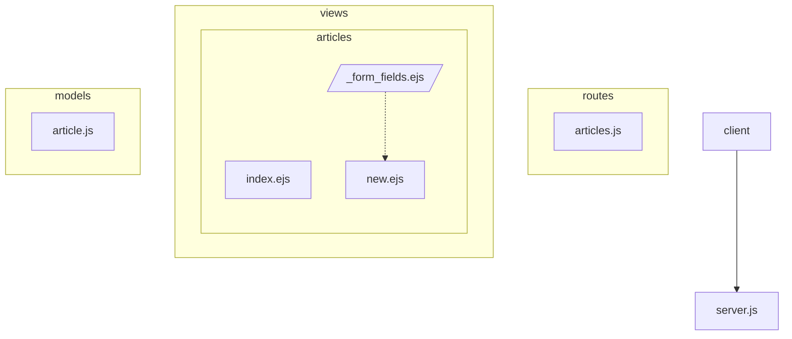
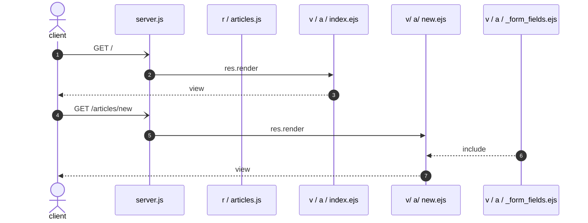

# All created routes and their purpose

## Access server

> Access to the server with address:
>> **localhost:5000**

## Routes list

### routes (View) : as table

| METHOD | URI                | SERVER WILL DO                                         |
| :----- | :----------------- | :----------------------------------------------------- |
| GET    | `/hello`           | will response 'hello world' |
| GET    | `/`                | will render 'article/index.ejs' and pass {articles: fake_articles} |
| GET    | `/articles/new`    | will render 'article/new.ejs' --> the new-article-form   |
| GET    | `/articles/🆔`     | will *give requested article from database* **[WIP]**   |
| POST   | `/articles/`       | will  create a new Article_model  |
|        |                    | will save it in MongoDB |
|        |                    | will redirect to `/articles/🆔` |
|        |                    | if *error*, will render '/articles/new.ejs' form and |

### (routes) View : as list

- GET `/hello`
  - will response 'hello world'

- GET `/`
  - will render 'article/index.ejs'
  and pass {articles: fake_articles} to the view

- GET `/articles/new`
  - will render 'article/new.ejs' --> the new-article-form  

- GET `/articles/🆔`  
  - will send a response with the id of article ou asked (temporarly)
  - SOON : will *give requested article from database* **[WIP]**

- POST `/articles/`
  1. will  create a new Article_model
  2. will save it in MongoDB
  3. will redirect to `/articles/🆔`
  4. if *error*,
      - will render '/articles/new.ejs' form 
      - and will pass {article: newArticle} to the view

